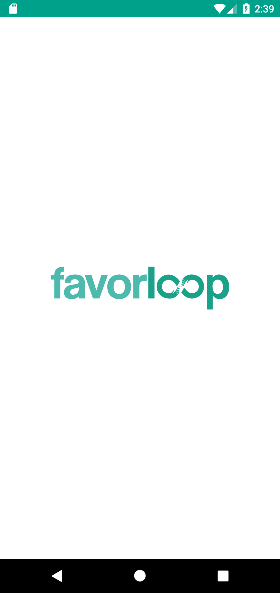

# FavorLoopPFC
Proyecto Fin de Ciclo 2021 UEM  
Desarrollado por:

| Santiago | Nacho | Sean | Juan |
|-|-|-|-|

FavorLoop es una app minimalista para solicitar y recibir ayuda de otras personas.

¡CREA LOOPS!  
Publica un 'Loop' solicitando ayuda y alguién te responderá.

¡ORGANIZA EVENTOS!  
Crea 'Eventos' para reunir a grupos de personas y realizar actividades comunitarias.

FEATURES:

~~~

- Interfaz sencilla e intuitiva
- Publica Loops para recibir ayuda
- Conoce a gente nueva
- Organiza eventos

~~~

| Splash | Login | Signup | Home | Loops | Eventos | Publicar Loop | Perfil | Amigos |
|:-:|:-:|:-:|:-:|-|-|-|-|-|
|  |  |  |  |  |  |  |  |  |
